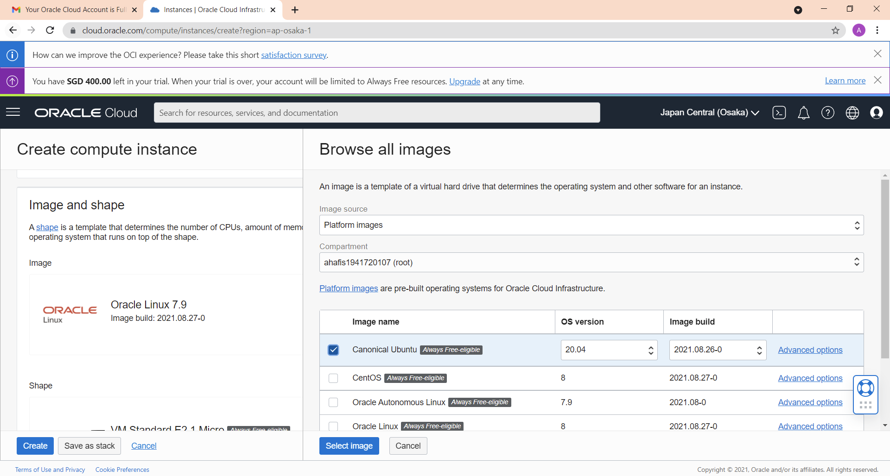
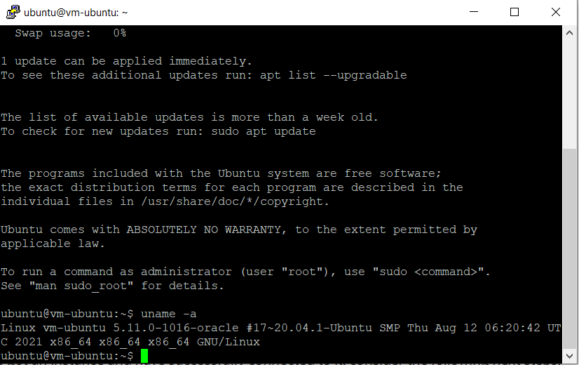

# 03 - Membuat Virtual Machine

## Tujuan Pembelajaran

1. Mengetahui layanan Oracle Cloud Infrastructure Compute
2. Mampu membuat Virtual Machine(VM) di layanan compute Oracle Cloud

## Hasil Praktikum

Berikut ini adalah bukti (hasil screenshoot) dari langkah-langkah praktikum dan tugas dari jobsheet 3-IaaS

### Langkah Praktikum 1-3
Berikut adalah hasil praktikum langkah 1-3

### Langkah Praktikum 4
Berikut adalah hasil praktikum langkah 4

### Langkah Praktikum 5
Berikut adalah hasil praktikum langkah 5

Gambar 5.1 : memilih images ubuntu

Gambar 5.2 : images telah diganti ke ubuntu
### Langkah Praktikum 6
Berikut adalah hasil langkah praktikum 6

Gambar 6.2 : melakukan save private key 
### Langkah Praktikum 7
Berikut ini adalah hasil langkah praktikum 7

Gambar 7.1 : men-klik tombol create untuk membuat vm

Gambar 7.2 : vm processing

Gambar 7.3 : VM saat running
### Hasil Praktikum
Berikut adalah hasil praktikum dari membuat VM

## Tugas
Carilah cara agar Anda dapat melakukan SSH ke VM yang baru dibuat berdasarkan praktikum tersebut!
### Hasil Pengerjaan Tugas
Berikut adalah hasil pengerjaan tugas untuk melakukan SSH ke VM
#### Langkah Ke-1
Lakukan convert private key berformat .key ke format .ppk di PuttyGen.

#### Langkah Ke-2
Klik Load untuk mengambil private key berformat .key untuk diubah ke format .ppk, jika sudah, klik save private key. Untuk nama file format .ppk, saya menggunakan nama privatekey.ppk

#### Langkah Ke-3
Berikut adalah hasil dari convert private key

#### Langkah Ke-4
Buka Putty, lalu masukkan hostname@public-ip-address

#### Langkah Ke-5
Pilih Category, kemudian klik Translation. Pastikan remote character set adalah UTF-8.

#### Langkah Ke-6
Masih di Category, Pilih Connection, Lalu expand SSH kemudian pilih Auth. Langkah ini untuk memasukkan private key yang sudah di convert ke format .ppk. Klik Browse untuk memasukkan lokasi dari private key tadi. Kemudian klik Open

#### Hasil Tugas
Setelah klik Open, akan muncul console yang dimana menunjukkan bahwa kita sudah masuk ke VM atau belum masuk dengan cara menuliskan ~uname -a untuk memperlihatkan versi ubuntu. Berikut adalah hasil dari pengerjaan tugas

[contoh link](../../src/01_pengantar/hello.js)