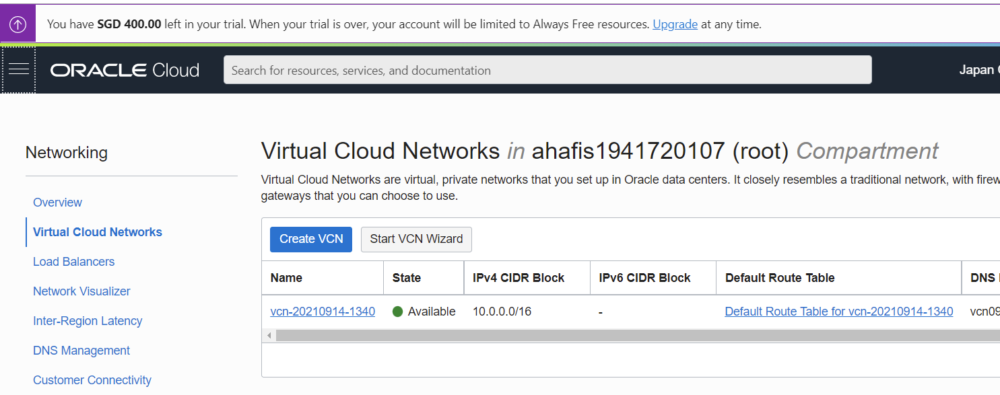

# 04 - Virtual Cloud Networks(VCN)

## Tujuan Pembelajaran

1. Mengetahui layanan Oracle Cloud Infrastructure Networking
2. Mampu mengaktifkan port 80 melalui Virtual Cloud Network (VCN) di layanan Oracle Cloud
3. Mampu memasang Apache server dan mengonfigurasi IP tables Firewalls

## Hasil Praktikum 1 : Mengaktifkan Port 80 melalui VCN di Oracle Cloud

Berikut ini adalah bukti (hasil screenshoot) dari langkah-langkah praktikum dan tugas dari jobsheet 4-VCN

### Langkah Praktikum 1-2
Berikut adalah hasil praktikum langkah 1-2

### Langkah Praktikum 3
Berikut adalah hasil praktikum langkah 3

### Langkah Praktikum 4
Berikut adalah hasil praktikum langkah 4

### Langkah Praktikum 5
Berikut adalah hasil praktikum langkah 5

### Langkah Praktikum 6
Berikut adalah hasil praktikum langkah 6

### Hasil Praktikum 1
Berikut adalah hasil praktikum 1

## Hasil Praktikum 2 : Setup Apache di VM

Berikut ini adalah bukti (hasil screenshoot) dari langkah-langkah praktikum dan tugas dari jobsheet 4-VCN

### Langkah Praktikum 1-2
Berikut adalah hasil praktikum langkah 1-2

### Langkah Praktikum 3
Berikut adalah hasil praktikum langkah 3

### Langkah Praktikum 4
Berikut adalah hasil praktikum langkah 4

### Langkah Praktikum 5
Berikut adalah hasil praktikum langkah 5

### Langkah Praktikum 6
Berikut adalah hasil praktikum langkah 6

### Hasil Praktikum 2
Berikut adalah hasil praktikum 2

## Tugas - Menginstall PHP di VM
Berikut adalah hasil dari tugas praktikum JS 04
### Langkah 1
Lakukan penginstallan php dengan menggunakan command seperti di foto

### Langkah 2
Lakukan Pengecekan php dan lakukan restart apache

### Langkah 3
PHP telah terinstall