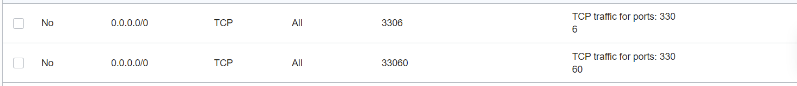

# 04 - PaaS

## Tujuan Pembelajaran
1. Mengetahui layanan yang ditawarkan cloud computing khususnya Oracle Cloud
Infrastructure (OCI)

## Hasil Praktikum : PaaS
Berikut ini adalah bukti (hasil screenshoot) dari langkah-langkah praktikum dan tugas dari jobsheet 5 - PaaS

### Langkah 1
Masuk ke oracle, lalu pilih di menu layanan database MySQL

### Langkah 2
Buat database baru di oracle

### Langkah 3
Sesuaikan isi dengan gambar dibawah

### Langkah 4
Buat username dan password

### Langkah 5
Sesuaikan dengan vcn yang dibuat minggu lalu

### Langkah 6
Sesuaikan isi dengan gambar dibawah

### Langkah 7
Sesuaikan isi dengan gambar dibawah

### Langkah 8
Sesuaikan isi dengan gambar dibawah, lalu klik Create

### Langkah 9
Tunggu hingga database aktif

### Langkah 10
Database telah aktif

### Langkah 11
Tambahkan port lewat Ingress Rules, pilih add ingress rules

### Langkah 12
Tambahkan port 3306,33060

### Langkah 13
Buka ssh lalu install MySQL

### Langkah 14
Masuk ke dalam MySQL untuk mengecek MySQL telah terdownload dengan memasukkan user,admin, dan host dari database

## Tugas Praktikum PaaS
Cari aplikasi php yang memiliki database kemudian upload ke server dan buat databasenya

### Step 1
Install git yang nanti akan digunakan untuk clone file php

### Step 2
Melakukan Clone dari github 

### Step 3
Membuat database untuk file php

### Step 4
Gunakan database yang baru dibuat

### Step 5
Untuk melihat file php, lakukan dengan menggunakan perintah ls

### Step 6
Edit file koneksi.php untuk menghubungkan ke database

### Step 7
Untuk membuka file php, gunakan ippublic/namafile

