# 06 - Kuis

## Soal Kuis
Lakukan setup aplikasi Wordpress di VM+DB yang kemarin telah dibuat, lalu buat laporan dan push di repo masing-masing.

### Langkah 1
Membuat database wordpress dan grand privileges wordpress ke admin
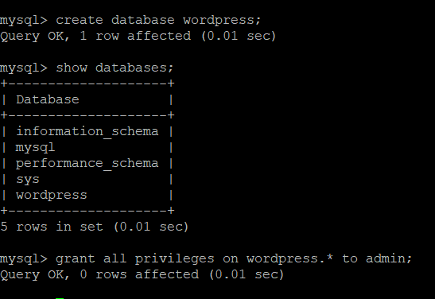
### Langkah 2
Di dalam direktori var/www/html, download wordpress dengan perintah seperti di foto
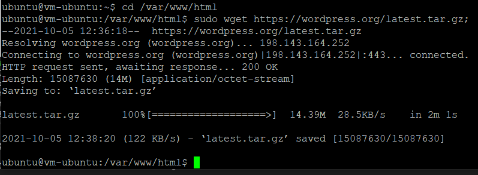
### Langkah 3
Melakukan ekstrak wordpress pada direktori var/www/html
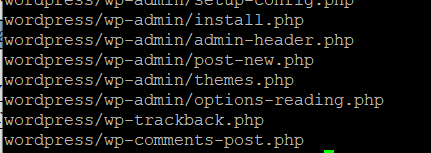
### Langkah 4
Menginstal ekstension mysql pada php
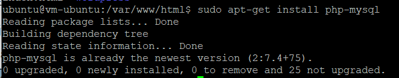
### Langkah 5
Menginstal apache pada direktori var/www/html
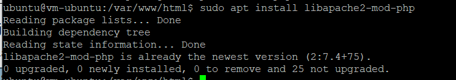
### Langkah 6
Melakukan instalasi php
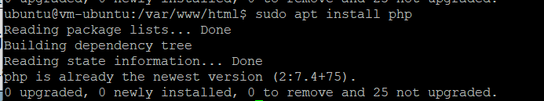
### Langkah 7
membuat file phpinfo(), berikut hasil phpinfo()
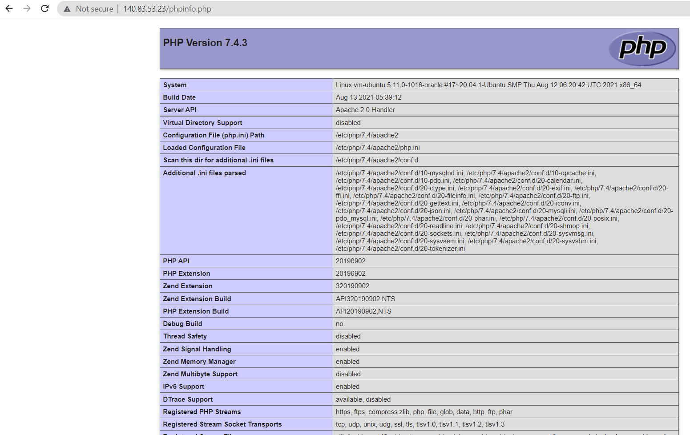
### Langkah 8
Mengaktifkan extension=php_mysqli
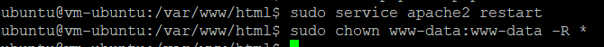

## Setup Wordpress
Dapat diakses dengan menggunakan ip public/wordpress/wp-admin/setup-config.php

### Langkah 1
Setelah setting bahasa, lalu setting databse yang akan dibuat
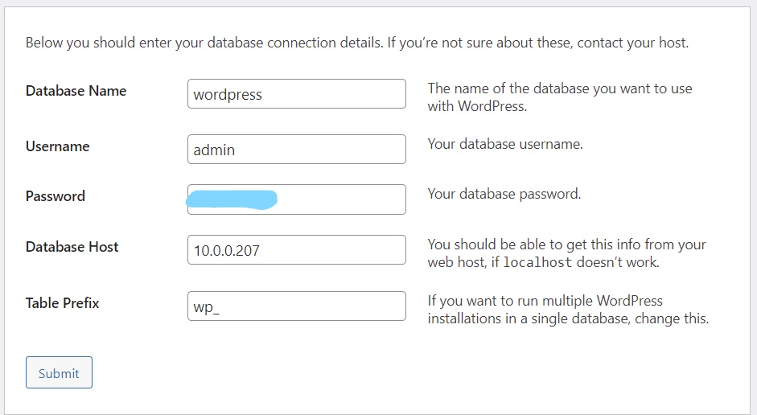
### Langkah 2
Setelah terbuat, klik Run the Installation
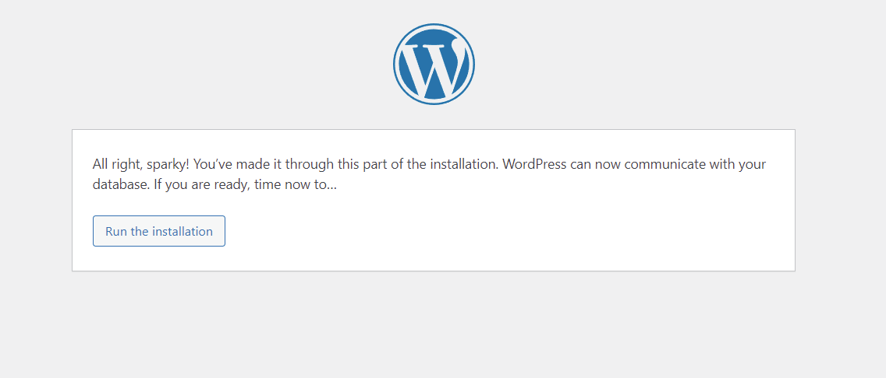
### Langkah 3
Lalu lakukan Pengisian Data Judul Site, Password dan Email
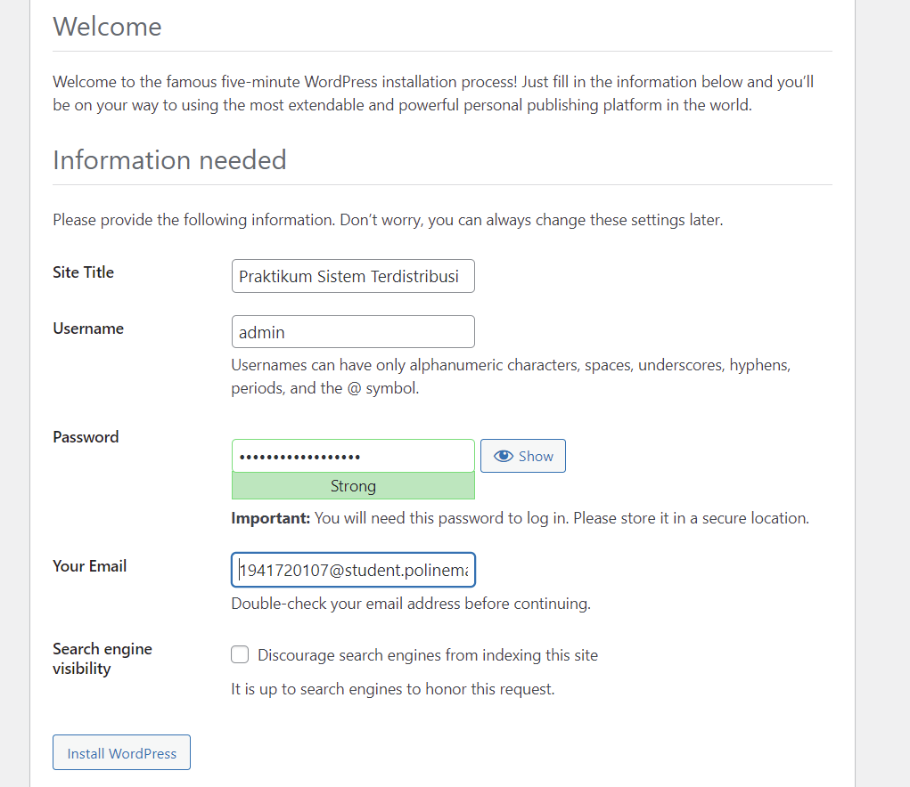
### Langkah 4
Wordpress Berhasil di install
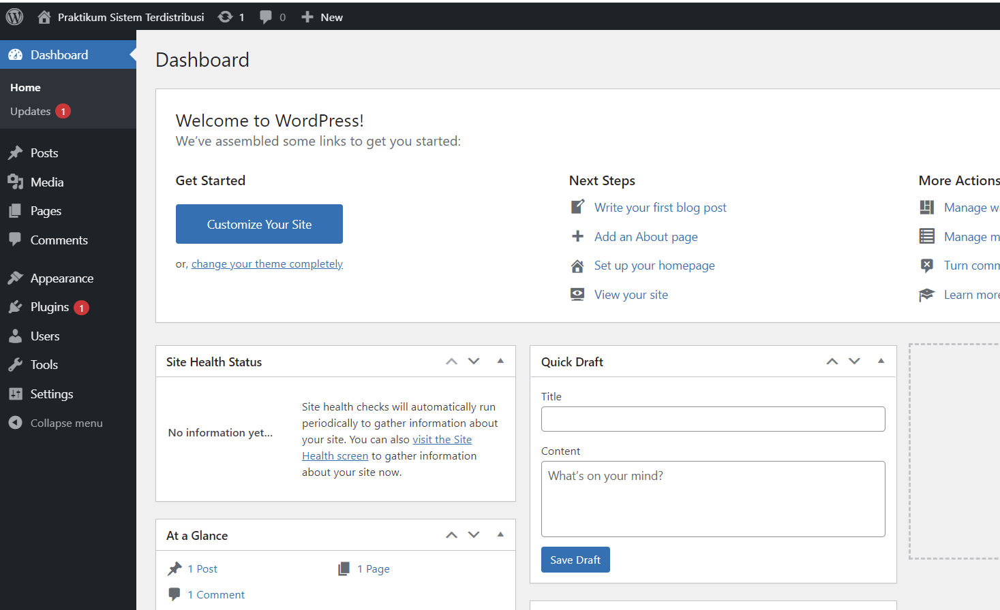