# 08 - Object Storage

## Tujuan Pembelajaran
1. Mengetahui Object Storage yang ditawarkan Oracle Cloud Infrastructure (OCI)
2. Dapat memanfaatkan layanan Object Storage yang ditawarkan Oracle Cloud Infrastructure (OCI)

## Hasil Praktikum : PaaS
Berikut ini adalah bukti (hasil screenshoot) dari langkah-langkah praktikum dan tugas dari jobsheet 8 - Object Storage

## Praktikum
### Langkah 1
Membuat bucket untuk website. Sign-in ke OCI kemudian pilih Object Storage.
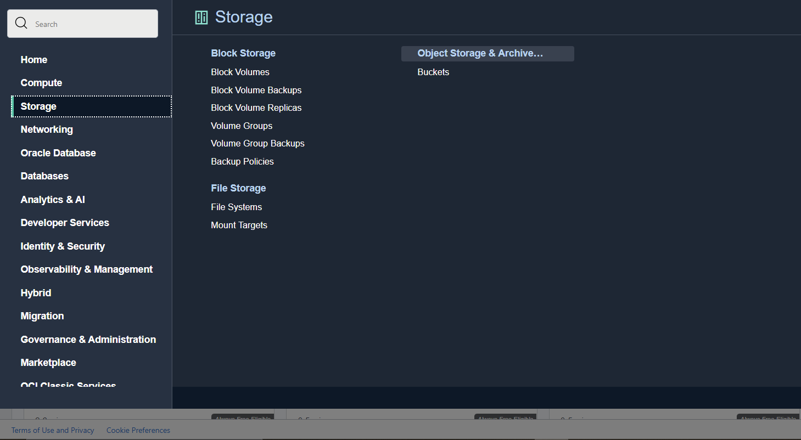
### Langkah 2
Create Bucket → Pilih standar bucket.
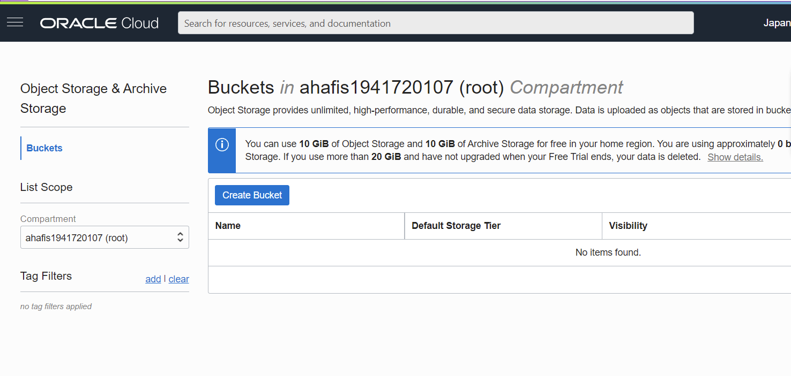
Bucket Name bebas
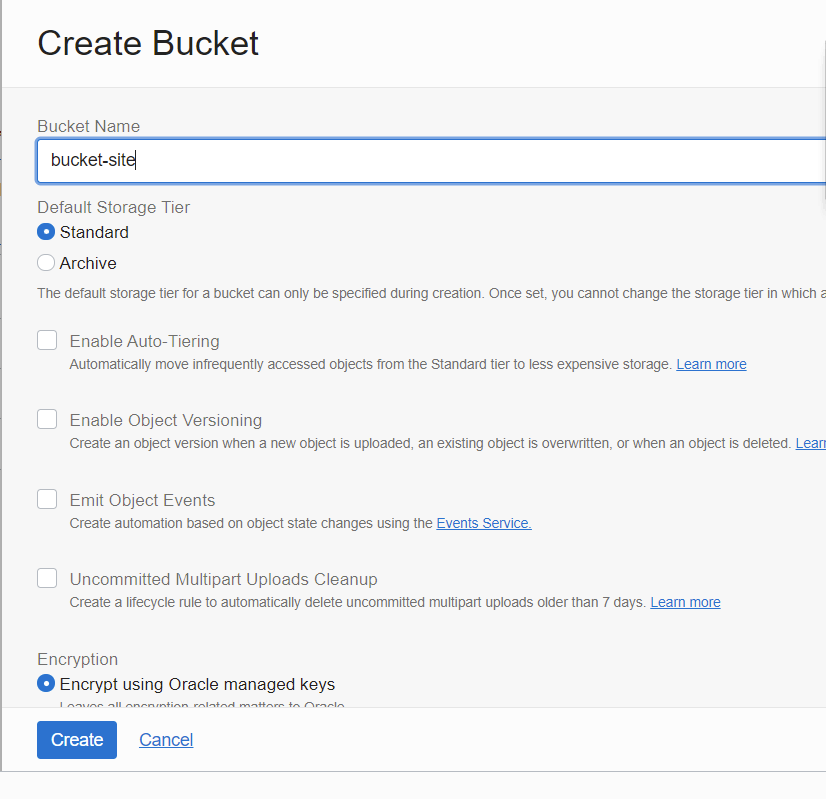
### Langkah 3
Buka bucket dengan melakukan klik pada nama bucket kemudian pilih Edit Visibility. Pilih Visibility
menjadi Public. Tekan Save Changes untuk menyimpan perubahan
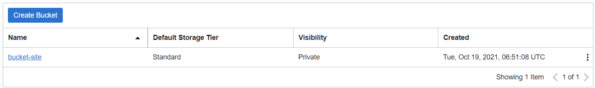
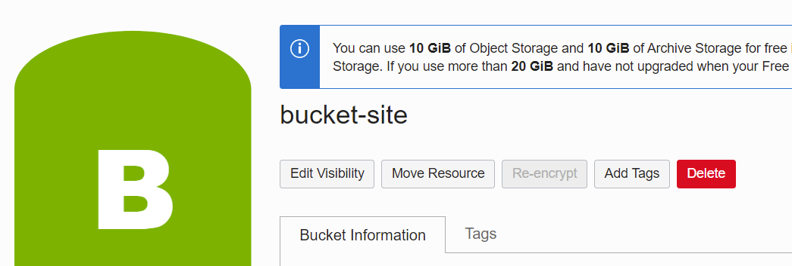
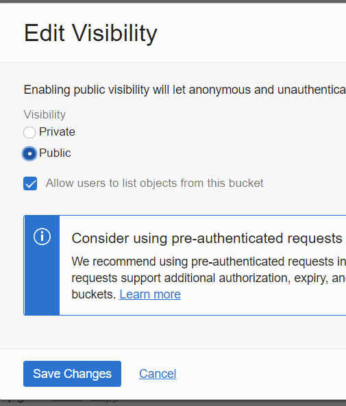
### Langkah 4
Uploading web page. Pada bagian bawah dari Bucket Information terdapat box Object (upload
semua file yang ada pada folder colorFliper)
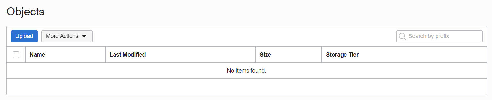
Setelah upload index.html file → Klik titik 3 pada sisi kiri file index.html.
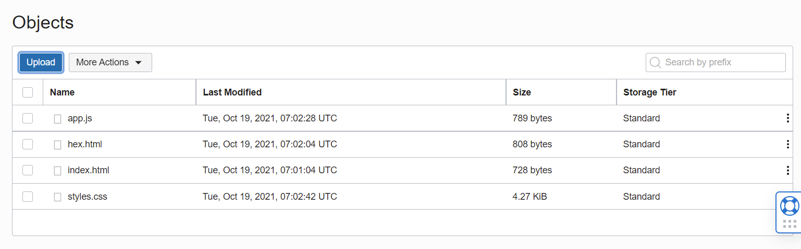
Kemudian pilih View Object Detail (Panel detail akan menunjukkan detail URL objek)
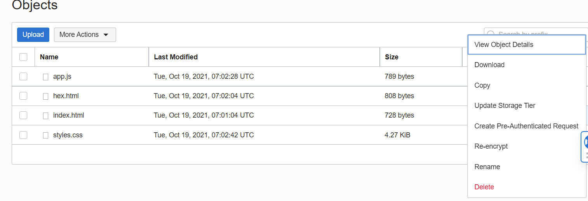
Kemudian pilih URL Path (URI) untuk membuka file
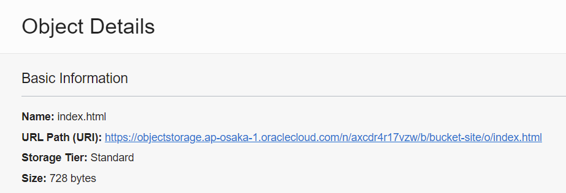
Jika file yang di upload berhasil tampilan pada halaman akan seperti pada gambar di bawah ini:
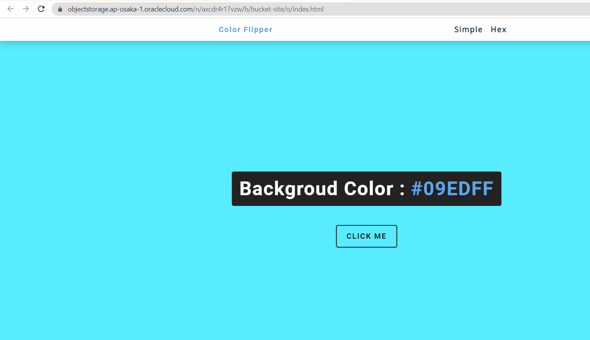

## Tugas
### Langkah 1
Upload File project web statis
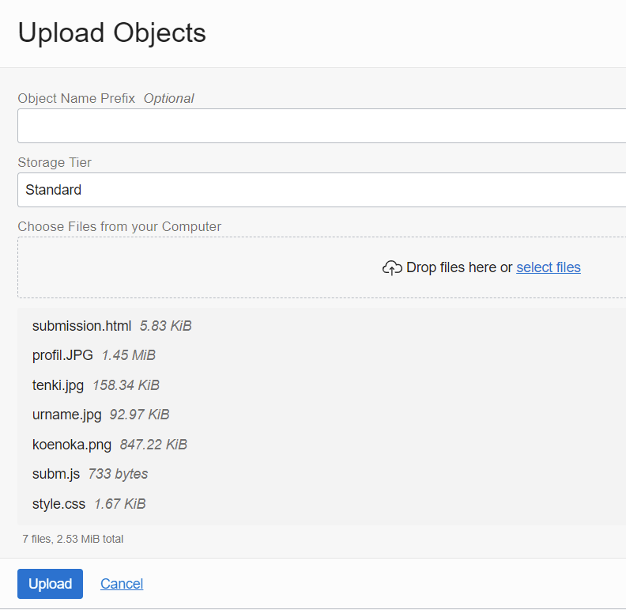
### Langkah 2
Pilih object detail di bagian file submission.html->tombol titik 3
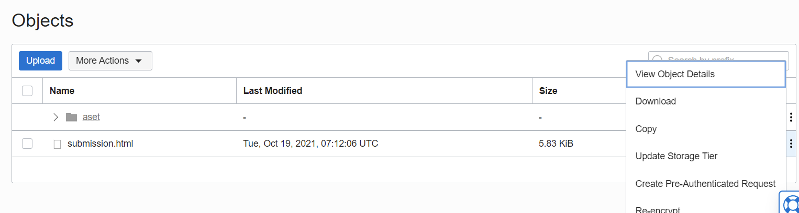
### Langkah 3
Klik URL
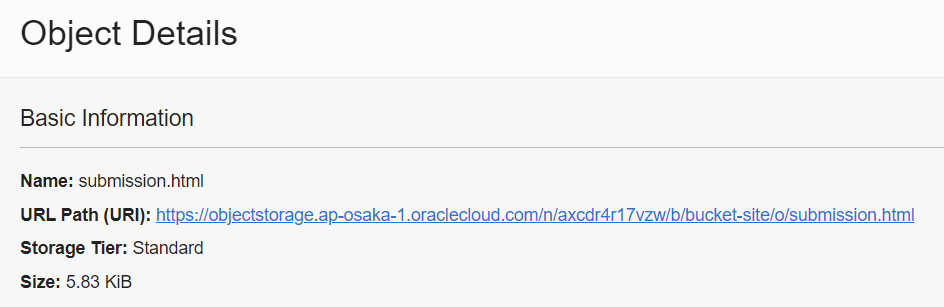
### Langkah 4
Web statis berhasil dibuka
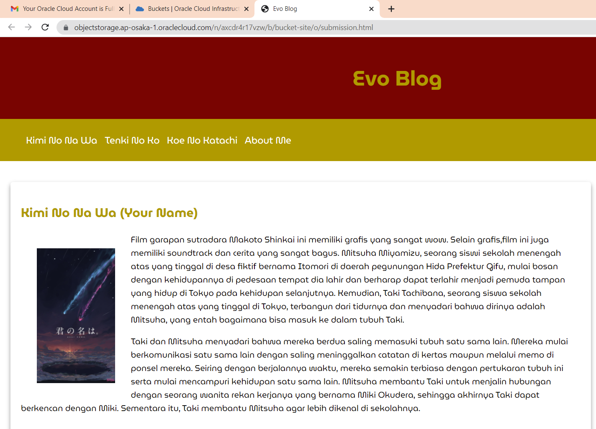