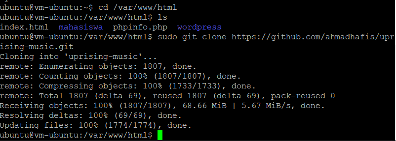
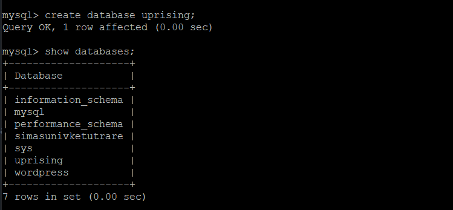
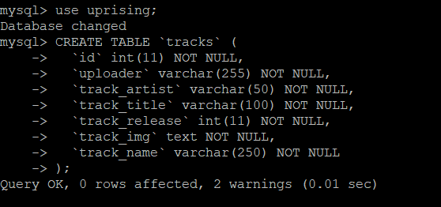
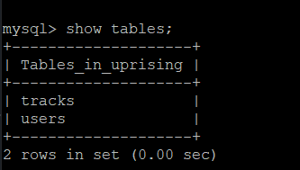
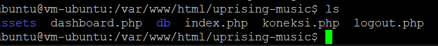

# 09 - UTS 

# Hasil UTS
Berikut ini adalah bukti (hasil screenshoot) dari langkah-langkah pengerjaan UTS

### Langkah 1
Membuat Bucket untuk menyimpan asset

### Langkah 2
Menambahkan asset

### Langkah 3
Clone project web yang akan digunakan

### Langkah 4
Buat database project

### Langkah 5
Copy dari file sql dan tambahkan ke database

### Langkah 6
Isi table project

### Langkah 7
Edit/buat file koneksi.php untuk menghubungkan dengan database yang telah dibuat

### Langkah 8
Jalan web dengan ippublic/nama
