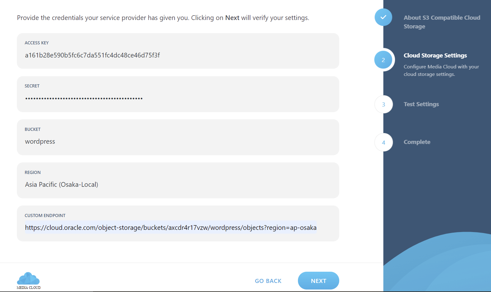

# 09 - UTS 

# Hasil UTS
Berikut ini adalah bukti (hasil screenshoot) dari langkah-langkah pengerjaan UTS

### Langkah 1
Membuat Bucket dengan nama wordpress.

### Langkah 2
Buka wordpress dan tambahkan plugin bernama Media Cloud.

### Langkah 3
Lalu setup Media Cloud, pilih S3 Compatible, lalu masukkan access key, secret key, bucket, dan custom endpoint.

### Langkah 4
Jika sudah, klik next untuk melakukan test konfigurasi.

### Langkah 5
Jika sudah, pilih finish.

### Langkah 6
Wordpress terhubung dengan bucket di Object Storage
