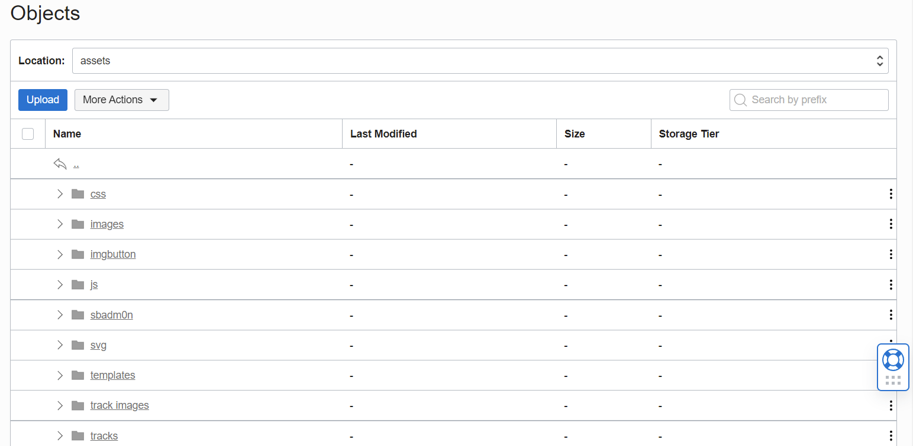

# 09 - UTS 

# Hasil UTS
Berikut ini adalah bukti (hasil screenshoot) dari langkah-langkah pengerjaan UTS

### Langkah 1
Membuat Bucket untuk menyimpan asset

### Langkah 2
Menambahkan asset

### Langkah 3
Tambahkan halaman index yang telah diubah lokasi assetnya

### Langkah 4
Klik path urlnya

### Langkah 5
Halaman berhasil dibuka

### Langkah 6
asset diambil dari bucket di Object Storage
