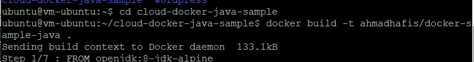
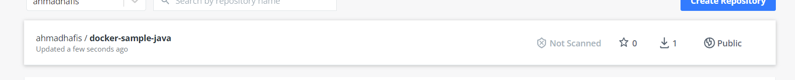

# 10 - Docker

## Tujuan Pembelajaran
1. Mengetahui perbedaan antara virtualisasi dengan container.
2. Mengetahui konsep docker dalam membangun sebuah aplikasi
3. Memanfaatkan container dalam membangun aplikasi
4. Mengetahui perintah dasar docker

## Hasil Praktikum : Docker
Berikut ini adalah bukti (hasil screenshoot) dari langkah-langkah praktikum dan tugas dari jobsheet 10 - Docker

# Praktikum
## Install Docker
### Langkah 1
Silakan masuk ke virtual mesin Anda kemudian jalankan perintah di bawah ini. Tunggu beberapa saat sampai proses update selesai, jika ada dialog yang menginfokan untuk dilakukan upgrade silakan dijawab dengan ‘y’.

Install paket yang dibutuhkan sebelum melakukan installasi docker, jalankan perintah
di bawah ini

Langkah selanjutnya yaitu menambahkan repository docker, dengan beberapa baris
perintah di bawah ini

Selanjutnya tuliskan perintah berikut

Selanjutnya tuliskan perintah berikut

Selanjutnya tuliskan perintah berikut. di perintah ini terlihat dari output bahwa docker belum terinstal.

### Langkah 2
Lakukan instalasi docker dengan perintah berikut

Ketika progress installasi sudah selesai, kemudian cek apakah docker daemon sudah jalan menggunakan perintah systemctl.

### Langkah 3
Untuk memastikan kembali, kita butuh menggunakan image test apakah docker benar - benar berjalan sebagaimana semestinya. Gunakan perintah di bawah ini

### Langkah 4
Untuk
menjalankan perintah docker tanpa menggunakan sudo, gunakan perintah dibawah

lakukan logout dari vm dan masuk kembali, dan jalan perintah dibawah ini

## Membuat Container
### Langkah 1
Untuk membuat container, tuliskan perintah berikut :

### Langkah 2
Gunakan perintah berikut dengan menggunakan telnet untuk mengecek container

## Membuat Akun Docker
### Langkah 1
Menuju halaman https://hub.docker.com/signup, kemudian isi data - data seperti docker id,email,dan password. Setelah Sign in maka tampilan akan seperti dibawah ini

## Build Image
### Langkah 1
Clone project yang terdapat di https://gitlab.com/0d3ng/cloud-docker-java-sample.git

### Langkah 2
masuk ke dalam direktori tersebut dan jalankan perintah build seperti berikut

### Langkah 3
Jika sudah jalankan container menggunakan image yang telah Anda buat menggunakan perintah berikut.

### Langkah 4
Lakukan login untuk mengupload ke docker hub

### Langkah 5
Selanjutnya upload image yang telah kita buat menggunakan perintah di bawah ini

### Langkah 6
Silakan cek docker hub Anda

