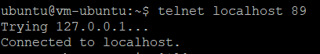

# 11 - Docker 2

## Tujuan Pembelajaran
1. Mahasiswa dapat mengetahui secara jelas network di Docker
2. Mahasiswa mengetahui konsep volume pada Docker
3. Mahasiswa mampu memanfaatkan dan menggunakan volume ataupun network ketika build image docker.
4. Mahasiswa bisa menggunakan docker compose dalam pembuatan aplikasi.

## Hasil Praktikum : Docker 2
Berikut ini adalah bukti (hasil screenshoot) dari langkah-langkah praktikum dan tugas dari jobsheet 11 - Docker 2

## Praktikum : Docker Network
### Membuat dan Memeriksa Docker Network
#### Langkah 1
- Pertama ketik perintah di bawah ini untuk mengetahui network yang tersedia pada docker host kita

#### Langkah 2
- Selanjutnya untuk mengetahui perintah-perintah dasar yang bisa digunakan untuk docker network

#### Langkah 3
- Untuk membuat network bisa menggunakan perintah create seperti pada gambar di bawah ini

#### Langkah 4
- Selanjutnya cek network yang sudah dibuat menggunkan perintah ls, seharusnya akan menambahkan network. Hasilnya adalah sebagai berikut

#### Langkah 5
- Terakhir, ketika ingin mengetahui informasi detail dari network yang telah kita buat bisa menggunakan perintah inspect

### Menghubungkan Container ke Network
#### Langkah 1
- Buat terlebih dahulu contoh container, misalkan kita akan membuat container linux yaitu busybox.

#### Langkah 2
- Buat container yang kedua menggunakan image linux alphine, buka windows yang baru agar container1 tetap berjalan

#### Langkah 3
- Kemudian cek masing-masing container tersebut menggunakan perintah ps untuk mengetahui status container yang sedang jalan. Buka windows baru, jalankan perintah berikut

#### Langkah 4
- Kemudian jalankan inspect untuk mengetahui informasi detail dari masing-masing container.

#### Langkah 5
- Untuk membuktikan silakan ping dari container1 ke container2, seharusnya akan reply.

### Membuka Port Container
#### Langkah 1
- Misalkan kita ingin membuat image dari apache, layanan httpd. Bisa dilakukan dengan perintah di bawah ini

#### Langkah 2
- Silakan cek menggunakan telnet terhadap port yang di-expose, seharusnya akan menghasilkan output seperti berikut

#### Langkah 3
- Kemudian untuk mengetahui port yang dilakukan expose pada container, bisa menggunakan perintah di bawah ini

## Praktikum : Docker Volume
### Membuat Volume
#### Langkah 1
- Buat terlebih dahulu folder di host(laptop/computer/vps), misalkan saya buat folder docker-shared.

#### Langkah 2
- Selanjutkan jalankan perintah dengan menambahkan parameter -v seperti berikut untuk mapping ke container yang akan kita buat, jangan lupa untuk masuk direktori volume, dan membuat file log.txt

#### Langkah 3
- Cek di folder local Anda, bisa menggunakan perintah ls atau dir. Dapat juga dilihat menggunakan windows explorer.

#### Langkah 4
- Perintah pertama yang bisa dijalankan adalah sebagai berikut, mengecek volume yang telah ada sebelumnya.

#### Langkah 5
- Perintah untuk membuat volume.

#### Langkah 6
- Jalankan container dengan menyertakan volume yang telah kita sebelumnya dan buat file log.txt, jangan lupa masuk ke direktori volume terlebih dahulu.

#### Langkah 7
- Buat container yang lain, dengan mengulangi langkah yang sama sebelumnya. Ketik perintah ls untuk mengetahui isi folder volume

### Menghapus Volume
#### Langkah 1
- Perintah untuk menghapus Volume.

## Praktikum : Docker Compose
#### Langkah 1
- Tuliskan perintah seperti di gambar berikut

#### Langkah 2
- Ubah docker compose menjadi executable menggunakan command berikut

#### Langkah 3
- Clone repo yang telah disediakan menggunakan git atau download secara manual.

#### Langkah 4
- Masuk ke direktori tersebut dan ganti branch menjadi cloud-docker dengan perintah seperti berikut ini

#### Langkah 5
- Build image tersebut menggunakan perintah build pada docker.

#### Langkah 6
- Selanjutnya buat folder data di bawah /opt agar data mysql tidak hilang ketika container dihapus

#### Langkah 7
- Jalankan docker compose menggunakan perintah berikut ini

- Hasil setelah di-fix

#### Langkah 8
- Untuk mengetahui container yang sedang berjalan menggunakan docker compose bisa dilakukan menggunakan cara sebagai berikut

- Hasil setelah di-fix

## Tugas
- Buat folder dengan nama composetest

- Buat file dengan nama app.py

- Menambahkan file baru bernama requirements.txt

- Menambahkan file Dockerfile

- Menambahkan file baru bernama docker-compose.yml

- Menjalankan docker-compose up

- docker-compose up berjalan
