# 12 - CI/CD

## Tujuan Pembelajaran
1. Mahasiswa dapat mengetahui tentang CI/CD
2. Mahasiswa dapat membuat pipeline
3. Mahasiswa dapat memahami tentang Variables, Secret, dan Token

## Hasil Praktikum : Docker 2
Berikut ini adalah bukti (hasil screenshoot) dari langkah-langkah praktikum dan tugas dari jobsheet 12 - CI/CD

## Hosting Static Website Menggunakan CI/CD Pipeline
### Menyiapkan Bucket Object Storage
- Masuk ke akun https://cloud.oracle.com dan navigasi ke menu Storage -> Buckets
- Tekan tombol Create Bucket, dan lengkapi Bucket Name dengan os-react. Biarkan nilai
lainnya dengan nilai default kemudian tekan tombol Create.
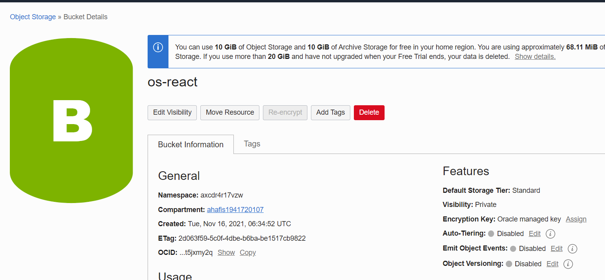
- Ubah visibility bucket dengan menekan tombol Edit Visibility, dan ubah menjadi public.
Tekan tombol Save Changes untuk menyimpan perubahan.
- Pada dashboard bucket, perhatikan nilai Namespace. Nilai ini nanti akan digunakan untuk
pengaturan deployment.
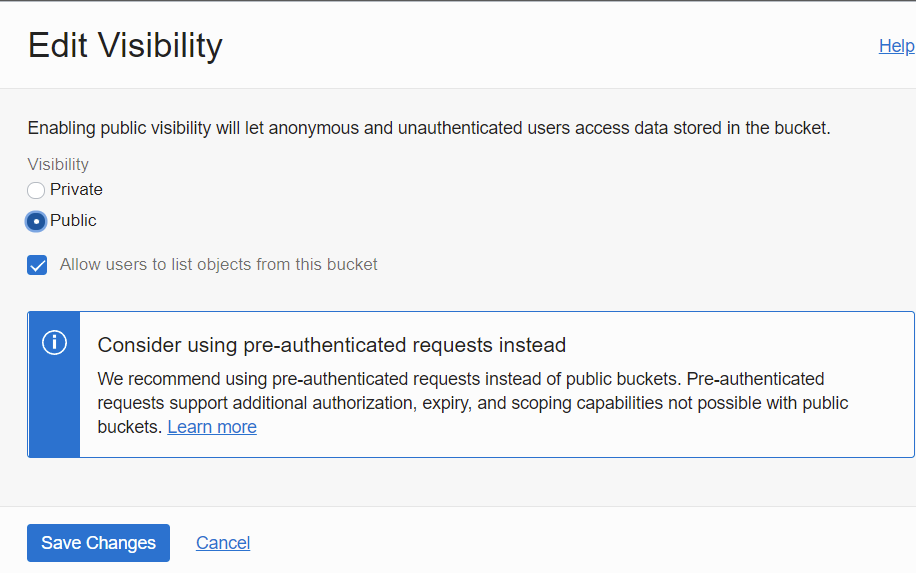
### Menyiapkan Project
- Download Node terlebih dahulu sebelum membuat project.
- Setelah Node terinstall, silahkan lakukan Langkah generate project
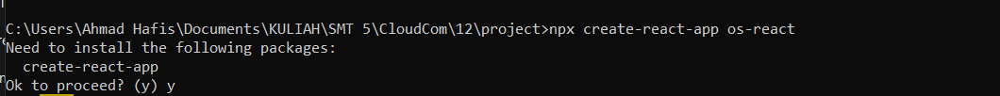
- Buatlah repository pada GitHub kemudian push project tersebut ke dalam repository.
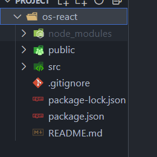
### Menambahkan Github Workflow
- Melakukan konfigurasi file build.yml
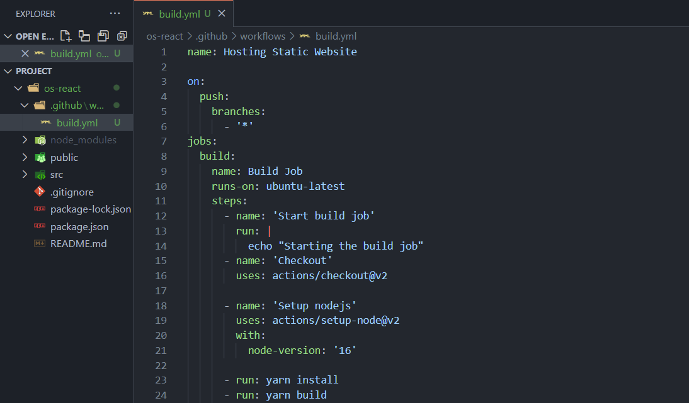
- Pada pengaturan pipeline, terdapat nilai secrets yang diatur melalui pengaturan pada
repository GitHub.
- Buka alamat repository GitHub, dan masuk ke menu Settings -> Secrets
- Lengkapi nilai semua secrets yang dibutuhkan. Kemudian push perubahan ke repository
GitHub.
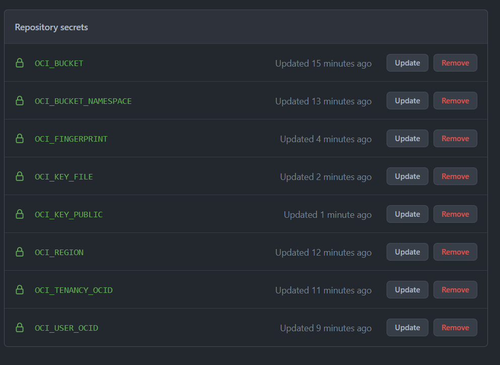
- Perhatikan tab Actions pada halaman repository. Cek hasil proses deployment apakah
terdapat kesalahan. Jika terjadi kesalahan, koreksi kembali nilai secrets yang dimasukkan.
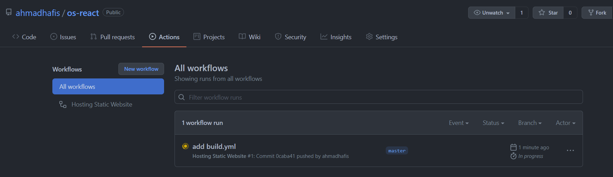
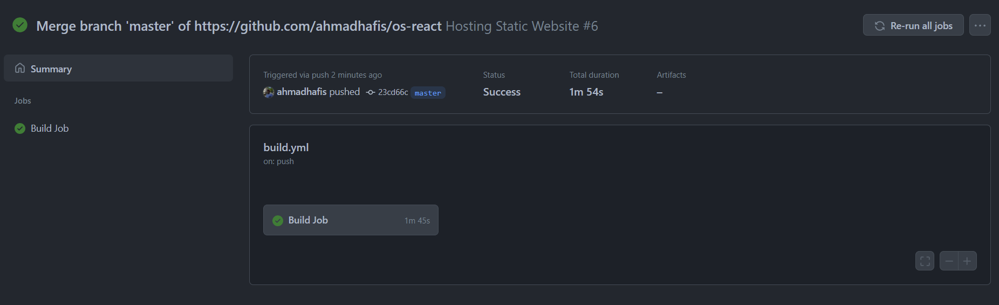
- Jika proses deployment sudah mendapatkan tanda centang hijau, silahkan kembali ke
dashboard bucket object storage. Centang berkas index.html, kemudian tekan menu titik
tiga dan pilih View Object Details.
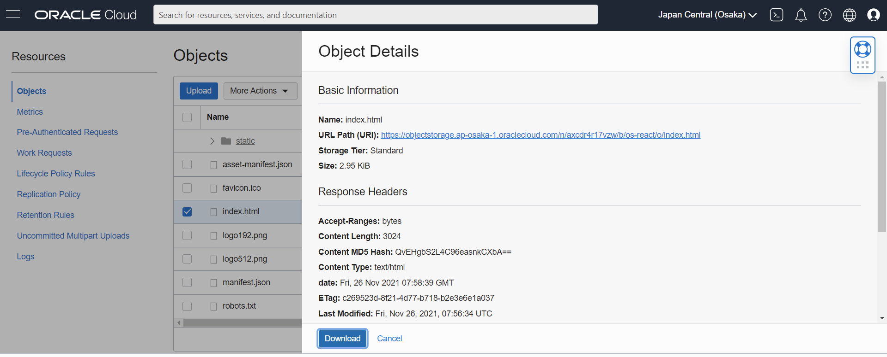
- Salin URL Path tanpa nilai index.html, kemudian buka kembali project React. Cari berkas
package.json dan tambahkan key “homepage” dengan nilai URL Path pada Object
Details.
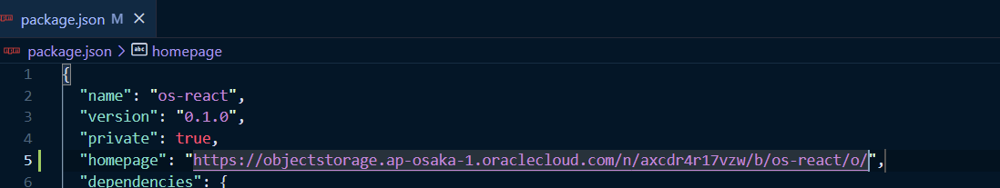
## Deploy Simple Website Menggunakan Docker CI/CD Pipeline
### Menyiapkan Project Repository
- Membuat project react baru, kemudian push project ke github
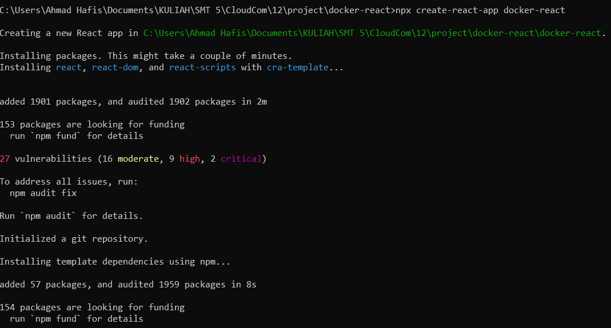
### Menyiapkan Akses Docker Hub
- Mendapatkan akses token docker dengan menuju Profile/Security/ New Access Token
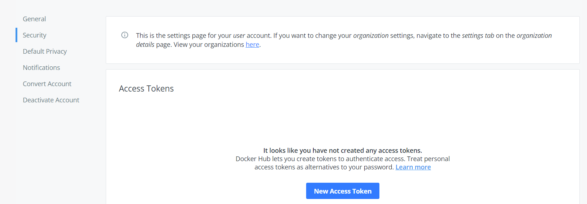
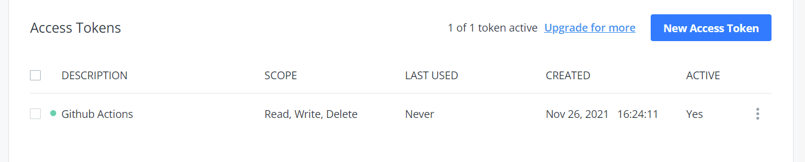
### Menambahkan GitHub Workflow
- Buat sebuah file dengan berkas yaml, pada lokasi .github/workflows/deploy.yml
- Tambahkan nilai-nilai secrets yang terdapat pada GitHub Workflow tersebut.
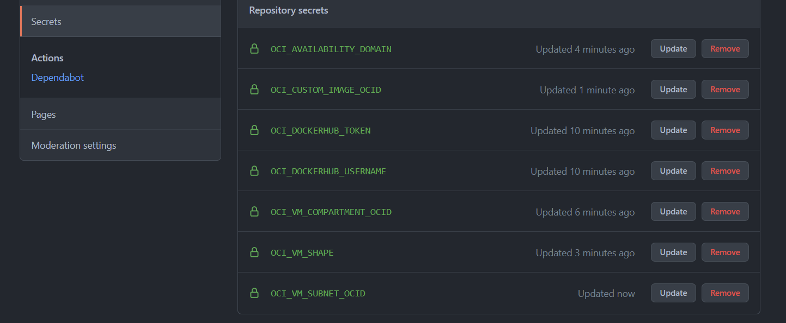
### Menyiapkan Dockerfile
- Buat sebuah file bernama Dockerfile
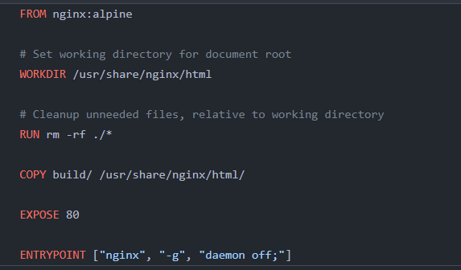
### Menyiapkan Docker Compose
- Buatlah berkas dengan nama docker-compose.yml
- Jangan lupa untuk mengubah nilai image sesuai dengan username docker hub.
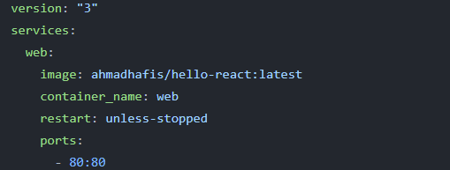
### Melakukan Deployment
- Setelah berkas deployment dan nilai secrets telah selesai diatur, lakukan push ke repository
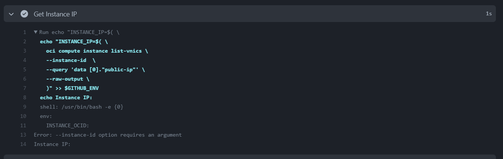
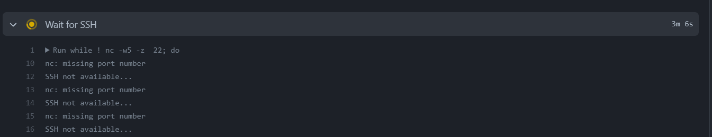