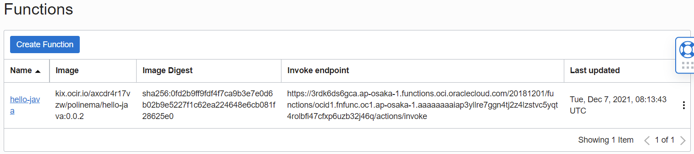

# 13 - Serverless

## Hasil Praktikum : Serverless
Berikut ini adalah bukti (hasil screenshoot) dari langkah-langkah praktikum dan tugas dari jobsheet 13 - Serverless

## Membuat Application dan Function
- Masuk ke akun https://cloud.oracle.com dan navigasi ke menu Developer Services -> Applications

- Tekan tombol Create Application dan lengkapi informasi form Name dengan hello-app. Lengkapi juga VCN dan subnet yang dibutuhkan. Jika anda belum mempunyai VCN, silahkan membuat terlebih dahulu VCN.

- Tekan tombol create dan tunggu sampai muncul halaman Getting Started.

- Aktifkan Cloud Shell dengan menekan tombol Launch Cloud Shell. Tunggu proses provisioning cloud shell selesai. Anda akan mendapatkan sebuah terminal built-in yang dapat digunakan untuk melakukan proses deployment.

- Ikuti langkah-langkah dengan melakukan copy perintah kemudian tempelkan ke dalam terminal Cloud Shell.
- Untuk menggunakan context region

- Untuk mengupdate context dengan function compartment ID

- untuk update context registry

- Melakukan proses pembuatan token untuk autentikasi. Tekan tombol Generate Token dan lengkapi form Description. Simpan token tersebut.

- Beri yang relevan (contoh: faas). 

- Copy dan simpan token untuk login 

- Log in ke Registry dengan Token yang telah di buat di Auth Tokens tadi

- Untuk memverifikasi daftar aplikasi yang ada di compartment

- Men-generate function "hello world" boilerplate(Semacam instalasi awal function)

- Pindah ke direktori function yang dibuat tadi

- Men-Deploy function

- Invoke function

- Navigasi menu ke Functions di sebelah kiri bawah. Anda akan mendapatkan detil fungsi yang tersedia. Pada halaman ini terdapat informasi mengenai Functions, serta invoke endpoint yang dapat digunakan untuk pemanggilan function.

## Memanggil Function
- Selain menggunakan fn, Function pada FaaS dapat juga dipanggil menggunakan oci-cli.
- Salin invoke endpoint kemudian panggil dengan format perintah sebagai berikut.
- oci raw-request --http-method POST --target-uri (invoke endpoint)

## Tugas
- membuat Applications baru dengan nama tugas-cloud
- gunakan cloud shell
- menggunakan context region

- mengupdate context dengan function compartment ID

-  update context registry

- melakukan log in

- men-generate function java
- pindah ke direktori yang telah dibuat

- lakukan pengubahan isi pom.xml, func.yaml, dan aplikasi java sesuai dengan yang ada di contoh samples
- Deploy function
- memanggil function

- Informasi function yang telah dibuat
