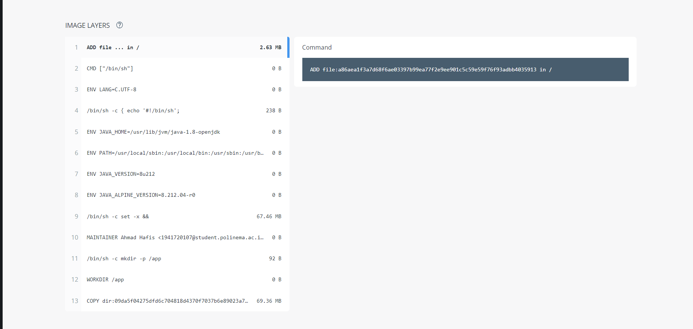

# 13 - Kuis 2

## Soal Kuis
Buatlah docker image dari project UTS kemarin di push ke docker hub.

### Langkah 1
- Melakukan clone project dari github

### Langkah 2
- Mengetik perintah build image dengan mengetik docker build -t namadocker/namaproject .

### Langkah 3
- Untuk memeriksa apakah image telah dibuat, bisa menggunakan perintah docker images

### Langkah 4
- Melakukan docker push yang nanti hasilnya akan muncul di docker hub

### Langkah 5
- Hasil push docker

### Langkah 6
- Isi image dari docker
