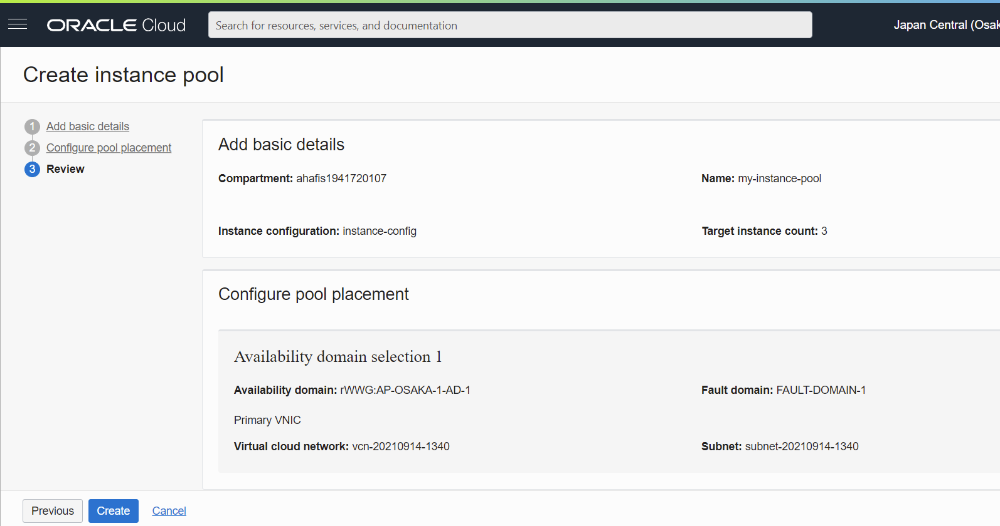

# 15 - Autoscaling

## Hasil Praktikum : Autoscaling
Berikut ini adalah bukti (hasil screenshoot) dari langkah-langkah praktikum dan tugas dari jobsheet 15 - Autoscaling

## Membuat Konfigurasi Instance
1.	Pada halaman detail instance, klik menu More Actions dan pilih Create Instance Configuration.
2.	Pilih kompartemen Anda.
3.	Untuk nama, masukkan instance-config.

4.	Click Create Instance Configuration.
5.  Hasil halaman detail

## Membuat instance pool
1.	klik Create Instance pool
2.	Dari daftar Kompartemen, pilih kompartemen tempat Anda membuat konfigurasi instance.
3.	Untuk nama, masukkan my-instance-pool.
4.	Dari daftar Konfigurasi Instance, pilih instance-config.
5.	Untuk number of instans, masukkan 3. Jumlah instans menunjukkan jumlah maksimum instance yang dapat disediakan di kolom instance. Jumlah instance yang dapat disediakan bergantung pada batas layanan penyewa Anda dan ketersediaan bentuk komputasi di wilayah Anda.

6.	Klik next
7.  konfigurasi instance pool

8.  Review dari hasil konfigurasi

9.  tidak dapat create karena jumlah number of instance terbatas

## Membuat konfigurasi Autoscalling
1.	Klik menu More Actions dan pilih Create Autoscaling Configuration.

2.	Untuk nama, masukkan my-autoscaling-config.
3.	Dari daftar Buat di kompartemen, pilih kompartemen tempat Anda membuat kumpulan instans.
4.	Klik Next.

5.  Pada halaman Configure Autoscaling Policy, Anda dapat memilih Metric-based Autoscaling atau Schedule-based Autoscaling

6.	Setelah Anda mengonfigurasi Autoscalling policy, klik Create. Anda dapat menentukan beberapa konfigurasi penskalaan otomatis untuk kumpulan instance yang sama, dan Anda dapat mengaktifkan atau menonaktifkannya salah satunya.

## Tugas
- Jelaskan Apa kaitan Autoscalling dengan Availability?
- Kaitan Autoscalling dengan Availability adalah Autoscaling menyeimbangkan kapasitas di seluruh Availability zone dan Autoscaling dapat menyeimbangkan instance secara otomatis.